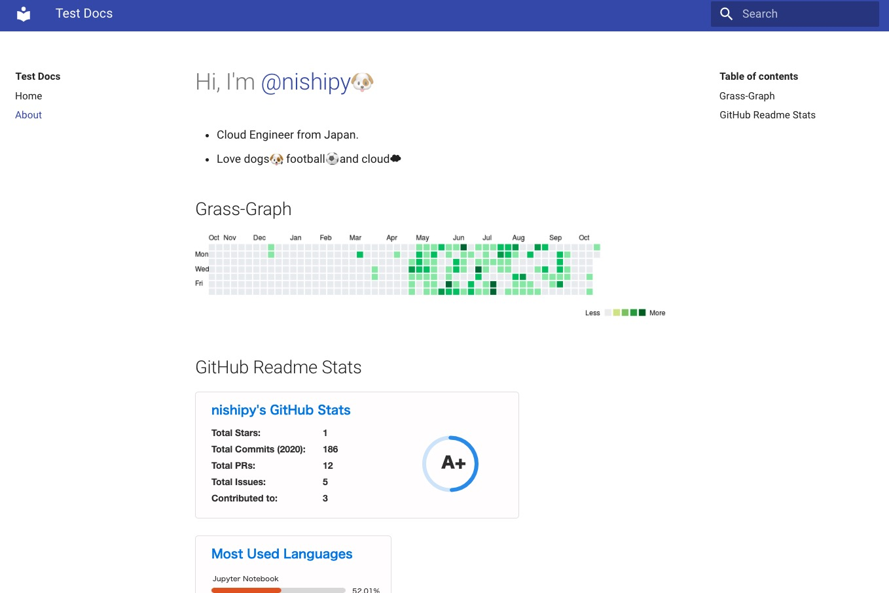
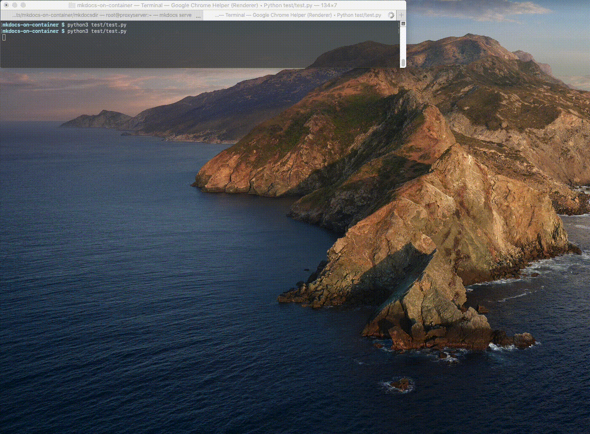

# Sample MkDocs on OpenShift
Enjoy!


## Versions
```
$ oc version
Client Version: 4.4.8
Server Version: 4.4.8
Kubernetes Version: v1.17.1+3f6f40d
```

## Deploy sample MkDocs
### Execute commands one by one
```
$ oc new-project mkdocs-dev
$ oc run mkdocs --image=nishipy/mkdocs:sha-512b185
$ oc expose deploymentconfigs.apps.openshift.io mkdocs --port 8000
$ oc expose service mkdocs
$ oc get route mkdocs
```

### Apply manifests
```
$ oc new-project mkdocs-dev
$ oc apply -f openshift/mkdocs-build.yaml
$ oc start-build mkdocs
$ oc apply -f mkdocs-deploy.yaml 
$ oc get all
$ oc get all
NAME                             READY   STATUS      RESTARTS   AGE
pod/mkdocs-1-deploy              0/1     Completed   0          13s
pod/mkdocs-1-nvgkh               1/1     Running     0          10s
pod/mkdocs-buildconfig-1-build   0/1     Completed   0          4m

NAME                             DESIRED   CURRENT   READY   AGE
replicationcontroller/mkdocs-1   1         1         1       13s

NAME             TYPE        CLUSTER-IP     EXTERNAL-IP   PORT(S)    AGE
service/mkdocs   ClusterIP   172.30.44.90   <none>        8000/TCP   14s

NAME                                        REVISION   DESIRED   CURRENT   TRIGGERED BY
deploymentconfig.apps.openshift.io/mkdocs   1          1         1         config

NAME                                                TYPE     FROM       LATEST
buildconfig.build.openshift.io/mkdocs-buildconfig   Docker   Git@main   1

NAME                                            TYPE     FROM          STATUS     STARTED         DURATION
build.build.openshift.io/mkdocs-buildconfig-1   Docker   Git@512b185   Complete   4 minutes ago   1m20s

NAME                                    IMAGE REPOSITORY                                                     TAGS     UPDATED
imagestream.image.openshift.io/mkdocs   image-registry.openshift-image-registry.svc:5000/mkdocs-dev/mkdocs   latest   2 minutes ago

NAME                              HOST/PORT                                                         PATH   SERVICES   PORT   TERMINATION   WILDCARD
route.route.openshift.io/mkdocs   mkdocs-mkdocs-dev.apps.cluster-0b14.0b14.sandbox265.opentlc.com          mkdocs     8000                 None
$ curl -I http:// mkdocs-mkdocs-dev.apps.cluster-0b14.0b14.sandbox265.opentlc.com
HTTP/1.1 200 OK
server: TornadoServer/6.0.4
content-type: text/html
date: Wed, 21 Oct 2020 09:24:36 GMT
accept-ranges: bytes
etag: "430093e25c19624006e7821343657e50"
last-modified: Wed, 21 Oct 2020 09:24:10 GMT
content-length: 11794
set-cookie: 1c202a3703d77115fc42db5d007cf155=c3178c8c7936f51f22b27eda0404af07; path=/; HttpOnly
cache-control: private
```

## Jenkins Pipeline
### 
```
$ oc new-project mkdocs-dev 
$ oc new-project app-devops #For jenkins
$ oc policy add-role-to-user edit system:serviceaccount:app-devops:jenkins -n mkdocs-dev
```

## Test
- Test by using Selenium
  